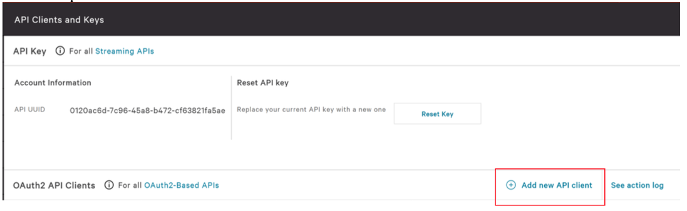
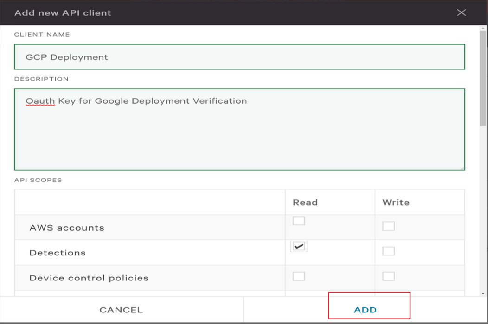
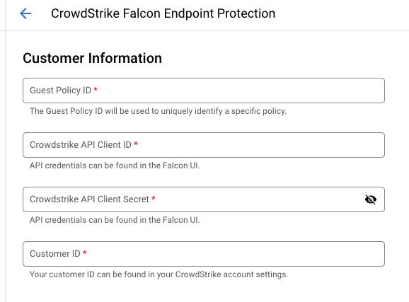
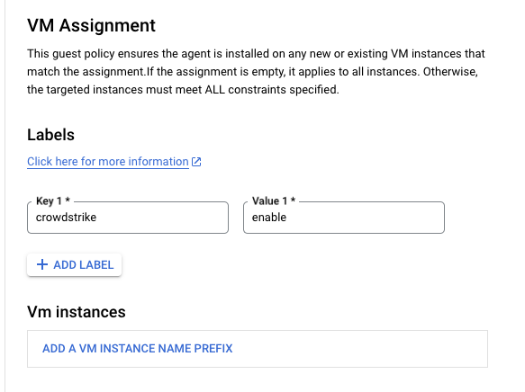
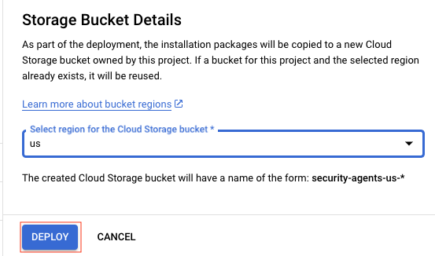

# CrowdStrike Falcon Sensor for Cloud Workload Protection: Google Cloud Platform

**This document describes how to deploy the CrowdStrike Falcon sensor across workloads in GCP.**

The integration installs and configures the sensor across instances of your choosing. Covering the following use cases.

* **Shorten Time to Deployment:** With a centralized repository to manage all sensor packages in one place, customers can quickly choose which software versions to install for providing endpoint protection for their workloads hosted in Google Cloud environments.
* **Improve Efficiency with Ease of Use:** Customers can manage all CrowdStrike Falcon sensor deployments from a single user interface as new workloads spin up. They can automate operational tasks to make workload deployments efficient and secure from bring-up time.
* **Gain Control and Visibility:** Organizations can gain control of the environment by allowing authorized users to retrieve and install Falcon sensors on workloads. Users can get full visibility into their infrastructure’s current operational state of workloads and sensors deployed.

## **Prerequisites:**

**Before you Begin:**

Verify that your environment meets the following requirements:

* Have installed the Google OSConfig Agent onto an eligible VM.

* Have a valid set of CrowdStrike API OAuth Client ID and Secret credential from https://falcon.crowdstrike.com/support/api-clients-and-keys

Prior to installing the agent, you will need to identify which VMs you would like to deploy to. This integration uses Google’s OSConfig agent which is supported on the following OSs:

1. Ubuntu
2. Windows
3. Red Hat Enterprise Linux

For an up to date list of supported operating systems visit:
https://cloud.google.com/compute/docs/manage-os#agent-install

The CrowdStrike sensor is designed to support a variety of Operating Systems and Kernel versions. You will need to ensure that the target Virtual Machine has a supported OS. The list can be found in the Falcon console under `Support → Docs → Sensor Deployment and Maintenance`. Make sure that you have deploy to Linux machines with supported Kernels.

While compiling your list of target VMs, best practice is to tag these machine with an OS Label. Instructions can be found: https://cloud.google.com/compute/docs/labeling-resources?hl=en_US#label_format. For example, you can setup your target VMs with a label of “crowdstrike” and a key of “enable”. This will help during the deployment so that we only deploy to machines we’d like to target.

After tagging your chosen machines, make sure to deploy the OSConfig Agent to the machines if not already.
https://cloud.google.com/compute/docs/manage-os#agent-install

If you have not created a key or do not know the secret for existing keys, you can create a new key by selecting
“Add new api client”

Google will not be using any API access to your account and will simply use the API keys to verify that you are a
current CrowdStrike customer. As such, you can delete the key later after deployment if you wish. Setup a new key as in the
image below:

You are now ready to proceed to install.

## **Installation Process:**

Once the prerequisites have been completed, fill in the below fields at:
https://console.cloud.google.com/security/agent/deployment/crowdstrike

1) Guest Policy ID: A unique name for this deployment policy.
2) CrowdStrike API Client ID: As generated
3) CrowdStrike API Client Secret: As generated
4) Customer ID: The CID for your CrowdStrike Account, copied from:
https://falcon.crowdstrike.com/hosts/sensor-downloads

Next, enter your Label key and Value from the Prerequisites section. You can also use VM Instance Name prefixs to target VMs. For example if all machines in the Dev group have the name “dev” prepended to the name, we can target machines like “dev-ib376”.

Finally, select an appropriate region for the sensor binaries to be copied to to stage them for install.

Clicking DEPLOY will deploy the sensor to the targeted images. You will be redirected to the hosts console of the CrowdStrike UI to check the status of new Hosts.  This may take 10-15 minutes to appear depending on your configuration of the OS Config agent. Existing and new machines that match the policies label or name prefix targeting will have the sensor installed.

When new machines are added, ensure that they are part of your existing sensor update and prevention polices, as some sensor versions may be released by CrowdStrike that are newer than the agents deployed. With auto updates, you can ensure your VMs have the latest version of the CrowdStrike Sensor.

## **Troubleshooting:**

If you encounter hosts that do not appear in the CrowdStrike Falcon Console, ensure that your targeting of the instances is correct and that your targets have the OSConfig agent installed. To Check if the agent has been installed, refer to: https://cloud.google.com/compute/docs/manage-os#agent-install

## **Additional Resources:**

Learn about the OSConfig Agent: https://cloud.google.com/compute/docs/os-configuration-management

Learn about deploying Security Agents with OSConfig: https://cloud.google.com/marketplace/docs/deploy-security-software-agents

Documentation on Deploying security software agents
